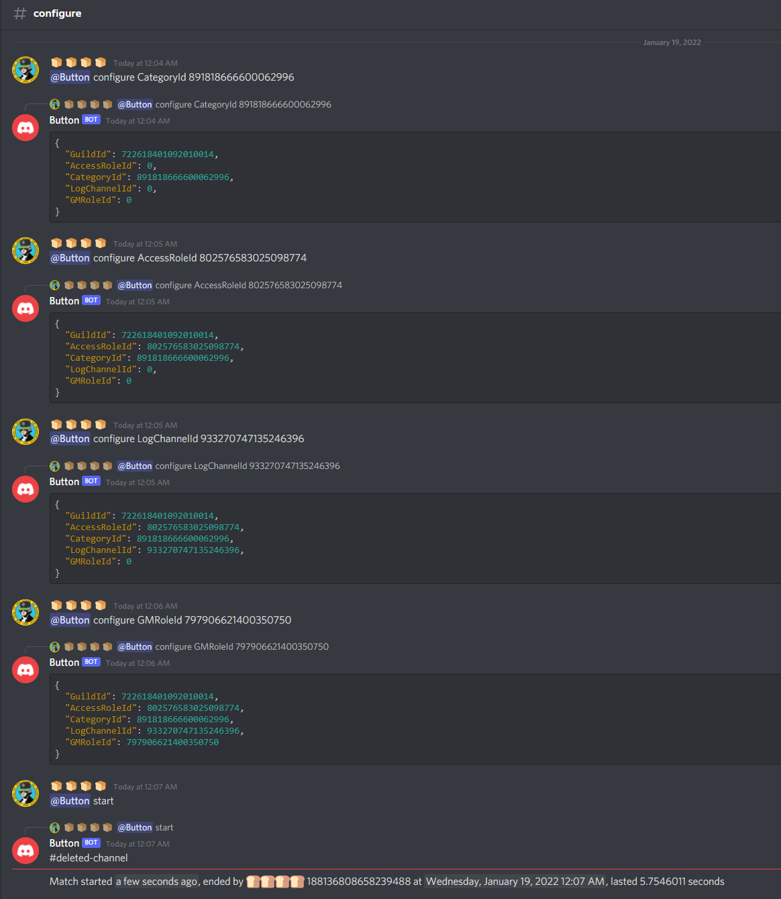

# The Button
Creates channels that immediately delete themselves when any message is sent there.

## Configuration

Ping the bot in every command. **All configuration values are required to start a match.**
Use bare IDs in place of '12345', not tags/mentions.

**Sets the ID of the role that gives access to all bot commands, including 'start'**
> @Bot configure GMRoleId 12345

**Sets the ID of the category the game channel will go in.**
> @Bot configure CategoryId 12345

**Sets the role that is required to see the game channel.**
> @Bot configure AccessRoleId 12345

**Sets the ID of the channel where game status is logged**
> @Bot configure LogChannelId 12345

## Start a match

> @Bot start

## Example

